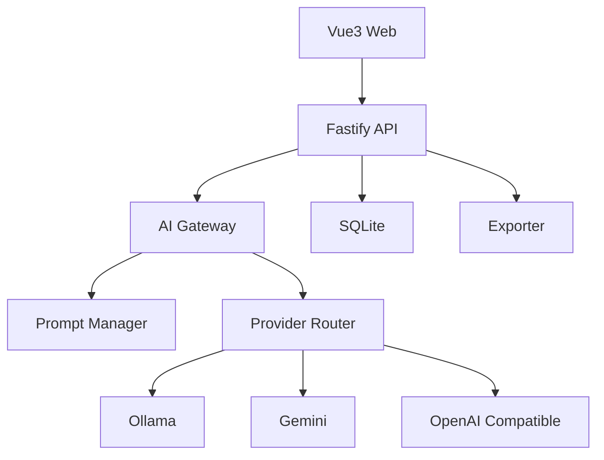

# ContentFlow Lite

> AI First MVP —— 一个专注于 **AI 图文内容生成** 的轻量级内容生产工具。

***

# 一、项目简介

ContentFlow Lite 是一个专门为内容创作者设计的 AI 内容生成工具。

它并不是一个聊天机器人，也不是一个通用 AI 平台，而是一个围绕"内容生产"设计的 MVP 项目。

整个项目只解决一件事情：

> 输入一个主题，输出一份可以直接发布的图文内容。

例如：

输入：

```
武功山喝什么
```

输出：

- 10 个爆款标题
- 6\~8 页图文内容
- 图片 Prompt
- 发布标签
- Markdown 文件

整个流程控制在几分钟内完成。

***

# 二、为什么做这个项目

目前 AI 内容创作通常需要频繁切换多个平台，例如：

- ChatGPT
- Claude
- Gemini
- 剪映
- 即梦
- Notion

整个流程通常如下：

```
主题

↓

AI

↓

修改

↓

生成图片 Prompt

↓

生成图片

↓

整理 Markdown

↓

发布
```

整个过程存在几个问题：

- 重复劳动较多
- Prompt 难以复用
- 内容风格不统一
- 每个平台都需要重新整理
- 很难实现自动化

ContentFlow Lite 的目标就是将整个流程统一起来。

***

# 三、项目定位

ContentFlow Lite 不是：

- ChatGPT
- Dify
- n8n
- Coze

它更像：

```
AI 内容生成器
```

而不是：

```
AI 工作流平台
```

MVP 阶段只聚焦：

> 内容生成。

不涉及：

- 多用户
- SaaS
- Agent
- 插件市场
- RAG
- 向量数据库
- MCP

这些内容都不属于 MVP。

***

# 四、设计原则

整个项目遵循以下几个原则。

## 1. MVP First

任何功能都应该围绕 MVP 展开。

如果一个功能不能帮助用户更快生成内容，就不应该进入当前版本。

整个项目始终保持简单。

***

## 2. AI First

整个系统围绕 AI 展开。

所有业务流程都应该服务于 AI，而不是服务于数据库。

AI 是整个项目的核心。

***

## 3. Prompt First

Prompt 是项目中最重要的资源之一。

Prompt 与代码分离。

Prompt 可以单独维护。

Prompt 可以单独升级。

Prompt 可以独立测试。

因此 Prompt 放在独立目录。

***

## 4. Provider Independent

AI Provider 不应该影响业务代码。

业务层永远不知道当前使用：

- Ollama
- Gemini
- Qwen
- OpenAI Compatible API

所有 Provider 都通过统一接口调用。

这样可以随时替换模型。

***

## 5. Fixed Workflow

MVP 阶段 Workflow 固定。

这样可以减少复杂度。

Workflow 如下：

```
Topic

↓

Prompt

↓

LLM

↓

Formatter

↓

Exporter
```

每个节点只有一个职责。

***

# 五、系统架构

整体架构如下。



整个系统只有四层。

第一层：

Web。

负责：

用户输入。

第二层：

API。

负责：

业务逻辑。

第三层：

AI Gateway。

负责：

统一管理所有 AI Provider。

第四层：

Provider。

真正执行 AI 推理。

这样的设计可以保证：

以后增加 Provider 时：

前端完全不用修改。

***

# 六、模块说明

## Web

负责：

- 输入主题
- 查看历史
- 查看生成结果
- 导出 Markdown

Web 不直接调用模型。

所有请求统一进入 API。

***

## API

API 是整个项目的入口。

主要职责：

- 参数校验
- Workflow 调度
- AI Gateway 调用
- 数据保存
- 导出

API 不负责 Prompt。

API 不负责 Provider。

***

## AI Gateway

AI Gateway 是整个项目最重要的模块。

它负责：

- 统一调用模型
- 屏蔽 Provider 差异
- 管理 Prompt
- 管理模型配置
- 返回统一结果

业务层只调用：

```
generate()
```

永远不知道：

底层是谁。

***

## Prompt Manager

Prompt Manager 负责：

- 读取 Prompt
- 替换变量
- 输出最终 Prompt

例如：

```
{{topic}}

↓

武功山喝什么
```

最终生成：

```
请根据武功山徒步场景生成适合抖音图文发布的内容……
```

Prompt 永远独立于代码。

***

## Exporter

Exporter 负责：

统一导出。

支持：

- Markdown
- JSON
- TXT

以后可以继续扩展。

***

# 七、内容生成流程

整个生成流程如下。

```
用户输入主题

↓

读取 Prompt

↓

填充变量

↓

调用 AI Gateway

↓

模型生成

↓

格式化内容

↓

保存历史

↓

导出 Markdown
```

整个流程保持线性。

没有分支。

没有循环。

没有复杂 Workflow。

这样可以保证 MVP 易于维护。

***

# 八、Workflow 示例

```
Input

↓

Prompt

↓

LLM

↓

Formatter

↓

Markdown
```

Input：

输入主题。

Prompt：

读取模板。

LLM：

调用模型。

Formatter：

统一格式。

Markdown：

输出最终结果。

# 九、Prompt 示例

Prompt 是整个项目的重要资产。

Prompt 与代码保持独立管理，所有模板统一存放在 `prompts/` 目录中。

下面是一个抖音图文生成的 Prompt 示例。

## System Prompt

```text
你是一名资深的新媒体内容策划。

你的任务不是介绍知识，而是生成能够直接发布的图文内容。

输出内容需要符合短视频平台的阅读习惯。

内容结构统一。

语言自然。

避免重复表达。

保证每一页内容长度均衡。

最终输出 Markdown。
```

***

## User Prompt

```text
主题：

{{topic}}

平台：

{{platform}}

风格：

{{style}}

输出要求：

1. 生成10个标题

2. 生成封面文案

3. 生成6~8页正文

4. 每页生成一段图片Prompt

5. 输出发布标签
```

Prompt 中所有变量均采用统一占位符。

例如：

```
{{topic}}

{{platform}}

{{style}}
```

统一变量可以提高 Prompt 的可维护性，也方便后续扩展更多平台。

***

# 十、目录设计

项目采用按职责划分目录，而不是按页面划分目录。

整体目录如下。

```text
ContentFlow-Lite

├── apps
│   └── web
│
├── server
│   ├── api
│   ├── gateway
│   ├── services
│   ├── repositories
│   └── providers
│
├── prompts
│
├── docs
│
├── exports
│
├── storage
│
└── .cursor
    └── rules
```

各目录职责如下。

### apps/

存放前端应用。

MVP 阶段只有一个 Web 项目。

未来如果增加桌面端或移动端，可以继续扩展，而不会影响现有目录。

***

### server/

存放所有后端代码。

server 不关心页面，只负责业务能力。

内部采用分层设计：

```
Route

↓

Service

↓

Repository

↓

Provider
```

这样可以保证职责清晰，便于后续维护。

***

### prompts/

统一管理 Prompt 模板。

任何内容生成都从这里读取模板。

Prompt 不应该散落在代码中。

这样可以让 Prompt 的调整不影响业务代码，也方便后续针对不同平台维护不同模板。

***

### docs/

项目文档。

包括：

- README
- PRD
- SPEC

所有设计文档统一维护。

***

### exports/

导出目录。

所有 Markdown、JSON、TXT 等导出文件统一放在这里，便于查找和管理。

***

### storage/

MVP 阶段采用 SQLite。

数据库文件统一放在 storage 目录。

避免数据库文件散落在项目根目录。

***

### .cursor/

存放 AI 开发规范。

Cursor、Claude Code 等工具会优先读取这里的规则文件。

这样可以保证 AI 生成代码风格一致。

***

# 十一、数据流

整个项目的数据流保持单向。

```text
User

↓

Web

↓

API

↓

AI Gateway

↓

Provider

↓

Formatter

↓

Storage

↓

Exporter

↓

User
```

整个流程不存在双向依赖。

模块之间只通过接口通信。

这样可以降低模块耦合度，提高可测试性。

***

# 十二、技术选型

## Vue 3

负责前端页面。

使用 Composition API。

便于逻辑复用。

***

## TypeScript

整个项目统一采用 TypeScript。

统一类型定义。

减少运行时错误。

***

## Fastify

负责 API 服务。

启动速度快。

插件机制简单。

适合作为 MVP 后端。

***

## SQLite

MVP 阶段不引入 MySQL。

SQLite 零配置、部署简单，非常适合单用户场景。

如果未来需要升级数据库，只需要替换 Repository 层即可。

***

## AI Gateway

AI Gateway 是整个项目最重要的抽象层。

它负责统一 Provider 的调用方式。

业务层始终使用统一接口，不感知底层模型差异。

这样既方便切换模型，也便于控制调用成本。

***

# 十三、MVP 边界

当前版本只关注内容生成闭环。

MVP 包含：

- 输入主题
- 内容生成
- Prompt 管理
- 历史记录
- Markdown 导出

当前版本不包含：

- 多用户
- 权限管理
- Agent
- 拖拽 Workflow
- RAG
- 插件市场
- 在线协作
- 自动发布

保持边界清晰，有助于控制开发成本。

***

# 十四、Roadmap

## v0.1

完成内容生成闭环。

包括：

- Topic
- Prompt
- AI
- Export

***

## v0.2

增加联网搜索。

根据主题自动补充资料，提高内容质量。

***

## v0.3

增加图片生成。

根据图片 Prompt 调用图片模型生成配图。

***

## v0.4

支持多个平台模板。

例如：

- 抖音
- 小红书
- 视频号

统一 Workflow，不同 Prompt。

***

# 十五、开发约定

整个项目遵循以下约定。

所有业务能力通过 API 提供。

所有 AI 能力通过 AI Gateway 提供。

所有 Prompt 独立管理。

所有模块保持职责单一。

所有数据对象保持统一命名。

所有导出能力统一由 Exporter 管理。

保持模块之间低耦合、高内聚。

***

# 十六、总结

ContentFlow Lite 的目标不是成为一个大型 AI 平台，而是在最小范围内完成一条稳定、可维护、可扩展的内容生产流程。

MVP 的价值在于快速验证产品，而不是提前设计复杂系统。

当这一条内容生产链路被验证后，再逐步扩展更多能力，而不是在第一版中一次性实现所有功能。

整个项目始终围绕一个核心目标：

**输入一个主题，稳定输出一份高质量、可直接发布的内容。**
