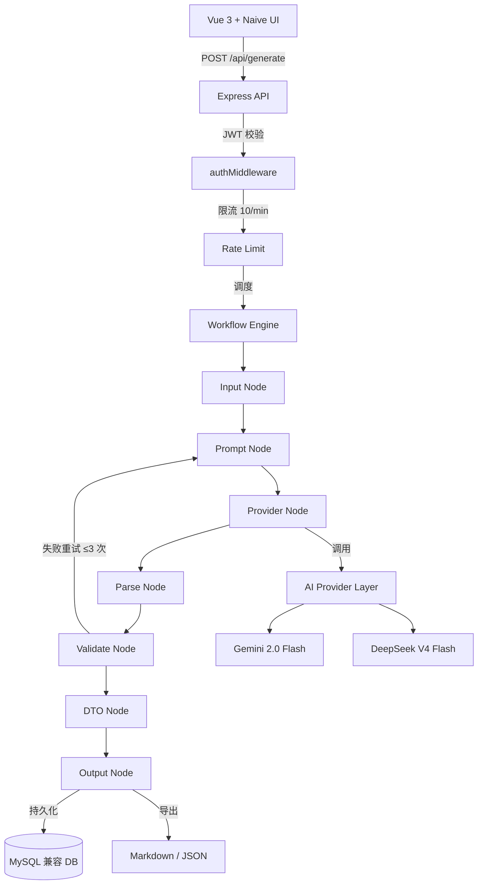

# ContentFlow Lite

> 一个基于 Workflow 的结构化 AI 内容生成框架 —— 输入一个主题，输出一份可直接发布的图文内容。

---

## 项目简介

ContentFlow Lite 是一个 AI 内容生成系统，核心围绕三个概念构建：

- **Workflow（流程编排）**：7 节点 Pipeline，串行执行，失败自动重试
- **Prompt Version（提示词版本控制）**：每次修改生成新版本，不可覆盖
- **Content DTO（统一数据结构）**：所有 AI 输出统一转换为标准 Content DTO

**输入 → 输出示例：**

```
输入: "武功山徒步喝什么"

输出:
  ├── 10 个爆款标题
  ├── 封面文案 + 封面图片 Prompt
  ├── 6~8 页图文内容（每页含正文 + 图片 Prompt）
  ├── 发布标签
  └── 结构化 Markdown / JSON
```

整个流程在几分钟内完成。

---

## 技术栈

| 层级 | 技术 | 说明 |
|------|------|------|
| 前端 | Vue 3 + Naive UI + Pinia + TypeScript | Composition API，UI 只渲染 DTO |
| 后端 | Express 5 + TypeScript | RESTful API，JWT 认证 |
| 数据库 | MySQL 兼容（TiDB / MariaDB / PlanetScale / RDS） | 8 张核心表，mysql2 连接池 |
| AI SDK | @google/genai + openai | Gemini 2.0 Flash / DeepSeek V4 Flash |
| 日志 | Winston（5 级日志 + DB Transport） | 对标 Spring Boot |
| 构建 | Vite（前端）/ tsx watch（后端热重载） | pnpm monorepo |

---

## 用户角色体系

系统使用三级角色模型，角色存储在 `users.role` 字段（ENUM）：

| 维度 | super_admin | admin | user |
|------|-------------|-------|------|
| **数量** | 系统唯一（仅 1 个） | 多个 | 多个 |
| **创建方式** | 首次启动交互式创建（或 `SUPER_ADMIN_PASSWORD` 环境变量） | 注册时提供 `ADMIN_SETUP_KEY` 或首个注册用户自动获得 | 默认注册角色 |
| **管理用户** | ✅ 全部用户，可修改任意角色 | ⚠️ 仅可管理 `user` 角色用户 | ❌ |
| **删除用户** | ✅ 可删除 admin 和 user | ⚠️ 仅可删除 `user`，不可删除自己和 admin | ❌ |
| **访问管理面板** | ✅ | ✅ | ❌ |
| **使用生成功能** | ✅ | ✅ | ✅ |
| **管理 Prompt 模板** | ✅ | ✅ | ✅（自己的模板） |
| **API Key 配置** | ✅ | ✅ | ✅（自己的 Key） |
| **不可被降级/删除** | ✅（受保护） | ❌ | ❌ |

**权限中间件：**
- `authMiddleware` — 任何已登录用户可过
- `adminGuard` — 仅 `admin` 和 `super_admin` 可过

---

## 系统架构



**四层架构：**

| 层 | 职责 | 位置 |
|----|------|------|
| Web | 用户输入、结果展示、DTO 渲染 | `client/src/` |
| API | 参数校验、Workflow 调度、认证限流 | `server/routes/` |
| AI Gateway | Provider 统一调用、屏蔽差异 | `server/providers/` + `server/workflow/` |
| Provider | 真正执行 AI 推理 | `server/providers/*-provider.ts` |

---

## 目录结构

```
ContentFlow-Lite/
├── client/                     # 前端（Vue 3 + Naive UI + Vite）
│   ├── package.json
│   ├── vite.config.ts
│   ├── tsconfig.json
│   ├── index.html
│   ├── src/                    # 前端源码
│   │   ├── pages/              # 页面组件
│   │   │   ├── HomePage.vue    # 首页 - 输入主题
│   │   │   ├── EditPage.vue    # 编辑页
│   │   │   ├── HistoryPage.vue # 历史记录
│   │   │   ├── PromptPage.vue  # Prompt 模板管理
│   │   │   ├── LoginPage.vue   # 登录/注册
│   │   │   ├── ProfilePage.vue # 个人设置
│   │   │   └── AdminPage.vue   # 管理面板（admin+）
│   │   ├── components/         # 通用组件
│   │   ├── stores/             # Pinia 状态管理
│   │   ├── services/           # API 调用封装
│   │   ├── router/             # Vue Router
│   │   └── types/              # 前端类型定义
│   └── public/                 # 静态资源
│
├── server/                     # 后端（Express + TypeScript）
│   ├── package.json
│   ├── tsconfig.json
│   ├── index.ts                # 入口：启动 + 超级管理员初始化
│   ├── app.ts                  # Express 应用装配
│   ├── config.ts               # 配置加载（.env + config.json）
│   ├── types.ts                # 全局类型定义
│   ├── routes/                 # API 路由
│   │   ├── auth.ts             # /api/auth/* 认证
│   │   ├── generate.ts         # POST /api/generate 生成
│   │   ├── content.ts          # /api/content/* 内容 CRUD
│   │   ├── prompt.ts           # /api/prompt/* 模板管理
│   │   └── admin.ts            # /api/admin/* 用户管理
│   ├── middleware/             # 中间件
│   │   ├── auth.ts             # JWT 守卫 + adminGuard
│   │   └── rate-limit.ts       # 限流配置
│   ├── workflow/               # 7 节点 Pipeline
│   │   ├── index.ts            # 引擎入口 executeWorkflow()
│   │   └── nodes/              # Input/Prompt/Provider/Parse/Validate/DTO/Output
│   ├── providers/              # AI Provider 实现
│   │   ├── index.ts            # Provider 注册中心
│   │   ├── gemini-provider.ts  # Gemini 2.0 Flash
│   │   ├── deepseek-provider.ts# DeepSeek V4 Flash
│   │   └── mock-provider.ts    # Mock 开发用
│   ├── db/                     # 数据库层
│   │   ├── client.ts           # 连接池
│   │   ├── schema.ts           # 8 张表建表 SQL
│   │   └── repositories/       # 数据访问层
│   ├── scripts/                # 管理脚本
│   │   ├── reset-super-admin.ts
│   │   ├── promote-admin.ts
│   │   └── migrate-role-enum.ts
│   └── utils/                  # 工具（logger 等）
│
├── prompts/                    # Prompt 模板独立存放
├── docs/                       # 项目文档（PRD/SPEC/types/PHASE_GATE）
├── scripts/                    # Phase Gate 脚本 + Git hooks
├── .rules/                     # AI 开发规范（9 个规则文件）
├── pnpm-workspace.yaml         # pnpm monorepo 配置
├── package.json                # 根 workspace 脚本
├── .env.example                # 环境变量模板
├── PROGRESS.md                 # 实现进度追踪
└── CLAUDE.md                   # Claude 任务路由
```

---

## Workflow 流程

后端 7 节点 Pipeline（`server/workflow/`），串行执行：

```
Input → Prompt → Provider → Parse → Validate → DTO → Output
  │        │         │          │         │         │        │
  │        │         │          │         │         │        └─ 持久化 + 导出
  │        │         │          │         │         └─ 构建 Content DTO
  │        │         │          │         └─ Schema 校验，失败重试 ≤3 次
  │        │         │          └─ 解析 AI 输出为 JSON
  │        │         └─ 调用 AI Provider 获取原始文本
  │        └─ 构建 FinalPrompt（system + user）
  └─ 接收用户输入，验证参数
```

**Validate 失败处理：** 校验不通过时，错误信息会注入 userPrompt，自动重试最多 3 次。

---

## AI Provider

| Provider | 模型 | 类型 | SDK | 状态 |
|----------|------|------|-----|------|
| Gemini | `gemini-2.0-flash` | 文本 | `@google/genai` | ✅ |
| DeepSeek | `deepseek-v4-flash` | 文本 | `openai`（兼容） | ✅ |
| Mock | — | 文本 | 内置假数据 | ✅ 开发用 |
| 硅基流动 | Qwen2.5-72B | 文本 | — | ❌ Phase 3 |
| 通义万相 | 图片生成 | 图片 | — | ❌ Phase 3 |

**配置方式：** 环境变量（`GEMINI_API_KEY` / `DEEPSEEK_API_KEY`）或 `user_settings` 表。用户手动选择 Provider，不做自动切换。

---

## API 端点

| 方法 | 路径 | 认证 | 限流 | 说明 |
|------|------|------|------|------|
| POST | `/api/auth/register` | — | 登录限流 | 用户注册 |
| POST | `/api/auth/login` | — | 5/min/IP | 用户登录，返回 JWT |
| GET | `/api/auth/me` | JWT | — | 获取当前用户信息 |
| POST | `/api/generate` | JWT | 10/min/用户 | 触发 Workflow 生成内容 |
| GET | `/api/content` | JWT | — | 获取内容列表 |
| GET | `/api/content/:id` | JWT | — | 获取单个内容 |
| DELETE | `/api/content/:id` | JWT | — | 删除内容 |
| GET | `/api/prompt` | JWT | — | Prompt 模板列表 |
| POST | `/api/prompt` | JWT | — | 创建模板 |
| GET | `/api/admin/users` | admin+ | — | 管理面板 - 用户列表 |
| PUT | `/api/admin/users/:id` | admin+ | — | 管理面板 - 修改用户 |

---

## 快速开始

### 环境要求

- Node.js ≥ 20
- pnpm ≥ 9
- MySQL 兼容数据库（本地 MySQL / TiDB Cloud / MariaDB）

### 1. 配置环境变量

```bash
cp .env.example .env
```

编辑 `.env`，必填项：

```bash
# 数据库
DB_HOST=127.0.0.1
DB_PORT=3306
DB_USER=root
DB_PASSWORD=your_password
DB_DATABASE=contentflow

# JWT
JWT_SECRET=your-secret-key

# AI Provider（至少配一个）
GEMINI_API_KEY=your-gemini-key
# 或
DEEPSEEK_API_KEY=your-deepseek-key

# 可选：直接设置超级管理员密码，跳过交互输入
SUPER_ADMIN_PASSWORD=your-admin-password
```

### 2. 安装依赖

```bash
pnpm install  # 一次安装 client + server 全部依赖
```

### 3. 启动开发服务器

```bash
# 终端 1：启动后端（端口 3001）
pnpm server:dev

# 终端 2：启动前端（端口 5173）
pnpm dev
```

### 4. 首次启动

后端首次启动时，如果数据库中无超级管理员，会自动提示创建。你也可以通过环境变量跳过交互：

```bash
SUPER_ADMIN_PASSWORD=your-password cd server && pnpm dev
```

### 5. 访问

- 前端：`http://localhost:5173`
- 后端健康检查：`http://localhost:3001/health`
- API 文档：`http://localhost:3001/api-docs`（Scalar UI）

---

## 设计原则

### 1. MVP First

任何功能围绕 MVP 展开。不能帮助用户更快生成内容的功能不进入当前版本。

### 2. AI First

系统围绕 AI 展开，所有业务流程服务于 AI 而非数据库。

### 3. Prompt First

Prompt 与代码分离，独立存放于 `prompts/` 目录。每次修改生成新版本，不可覆盖。

### 4. Provider Independent

业务层通过统一接口调用 AI，不感知底层模型差异。可随时替换模型而不影响业务代码。

### 5. Fixed Workflow

MVP 阶段 Workflow 固定为 7 节点 Pipeline，减少复杂度。每个节点只有一个职责。

---

## 当前开发状态

| Phase | 内容 | 状态 |
|-------|------|------|
| Phase 0 | 基础设施（DB + Express 骨架） | ✅ 已完成 |
| Phase 1 | 后端核心（Auth + Workflow + Provider + API） | ✅ 已完成 |
| Phase 2 | 前端重构（Naive UI + 认证 + 生成 + 编辑） | 🔵 进行中 |
| Phase 3 | 管理与增强（AdminJS + 图片生成 + 发布） | ❌ 未开始 |
| Phase 4 | 测试与发布（E2E + 部署 + 文档） | ❌ 未开始 |

详见 [`PROGRESS.md`](./PROGRESS.md)。

---

## Roadmap

- **v0.1** ✅ 内容生成闭环（Topic → Prompt → AI → Export）
- **v0.2** 🔵 前端 Naive UI 重构
- **v0.3** ❌ 图片生成（通义万相）+ 多平台模板（抖音/小红书/视频号）
- **v0.4** ❌ AdminJS 管理面板 + 发布记录 + E2E 测试

---

## 开发约定

- 所有 AI 输出必须转换为 Content DTO
- 所有生成必须经过 Workflow 逻辑
- 任何 Prompt 修改生成新版本，不允许覆盖
- UI 只负责渲染 DTO，不允许业务逻辑
- 后端路由只做校验，Repository 只做 CRUD
- 禁止直接 `console.log`，必须通过 Logger 模块
- 所有 API 注释使用 JSDoc，自动生成 OpenAPI 文档
- 代码风格统一，请遵循 `.rules/` 目录下的规范

---

## 如何拆分前后端

当前 `client/` 和 `server/` 通过 pnpm workspace 组织在同一个仓库中。如果将来需要拆分为两个独立仓库（前后端团队独立开发、独立部署）。

### 当前耦合状态

前后端之间**没有任何代码级 import 依赖**，只通过 HTTP API 契约通信。已完成的解耦工作：

| 解耦点 | 文件 | 机制 |
|--------|------|------|
| `.env` 加载 | `server/env.ts:17-20` | 优先读 `server/.env`，不存在则回退根 `.env` |
| `config.json` 加载 | `server/config.ts:31` | 从 server 自身目录加载 |
| 管理脚本 | `server/scripts/*.ts` | `import.meta.url` 显式路径，不依赖 `cwd` |
| API 基地址 | `client/src/utils/api-client.ts:12` | `VITE_API_URL` 环境变量，默认 `localhost:3001` |

### 拆分步骤

**第一步：准备 server 仓库**

```bash
# 将 server/ 复制为新仓库
cp -r server/ contentflow-server/
cd contentflow-server

# 创建自己的 .env
cp .env.example .env
# 填入 DB / JWT / AI Key 等配置
```

server 可独立运行，不需要任何代码修改：
```bash
pnpm install
pnpm dev    # tsx watch index.ts，端口 3001
```

**第二步：准备 client 仓库**

```bash
# 将 client/ 复制为新仓库
cp -r client/ contentflow-client/
cd contentflow-client

# 配置后端地址
echo 'VITE_API_URL=https://your-api.example.com' > .env
```

client 可独立运行：
```bash
pnpm install
pnpm dev    # vite，端口 5173
```

**第三步：清理 monorepo 胶水代码（可选）**

拆分后各自仓库中不再需要的文件：

| 删除 | 原因 |
|------|------|
| `pnpm-workspace.yaml` | 单包仓库不需要 |
| 根 `package.json` 中的 `--filter` 脚本 | 直接 `pnpm dev` 即可 |
| `scripts/phase-gate.sh` 中对方仓库的检查项 | 各自维护 CI |
| `server/env.ts` 中回退根 `.env` 的逻辑 | 不再有根 `.env` 可回退 |

### 需要关注的风险

1. **类型定义不一致**：`server/types.ts` 和 `client/src/types/index.ts` 各自维护了一套 `Content`、`Page`、`Title` 等类型，目前已有细微差异。拆分后建议以 `server/types.ts` 为 source of truth，通过 API 文档（Scalar UI）自动生成的 OpenAPI schema 作为契约。

2. **CORS 配置**：独立部署时 server 的 `CORS_ORIGIN` 必须设为 client 的实际域名，不再是 `localhost:5173`。

3. **Phase Gate 系统**：`scripts/phase-gate.sh` 深度绑定 monorepo 结构。拆分后需各自建立独立的 CI 检查。
